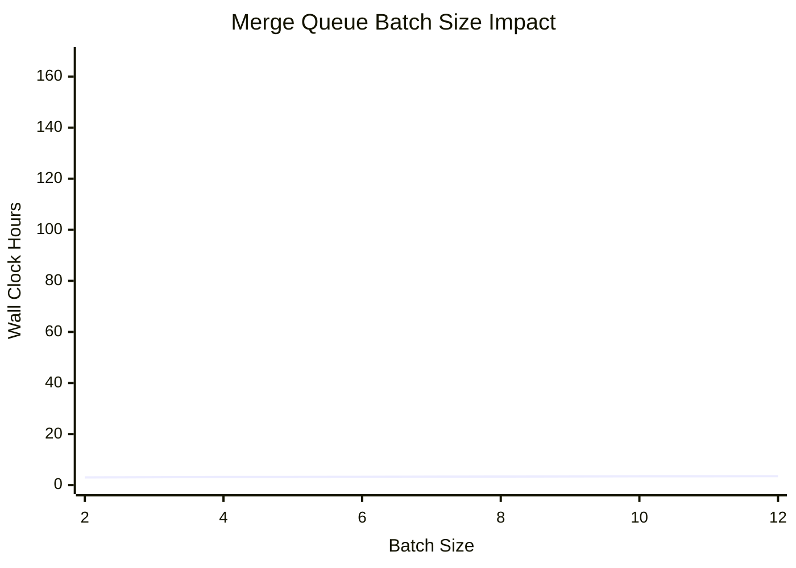

# Merge Queue Sweep Report

## Scenario
- PRs: 100
- Tests per PR: 1200
- Trials: 50
- CI runners: 12

## Baseline (Without Merge Queue)
- Wall Clock: 152.66 h
- Runner Minutes: 103731.01
- Suite Runs: 5060.0
- Throughput: 0.66 PR/hour

## Sweep Results
| Batch | Wall Clock (h) | Runner Minutes | Suite Runs | PR/hour | Wall Clock Reduction | Throughput Gain |
|---:|---:|---:|---:|---:|---:|---:|
| 2 | 3.02 | 2147.64 | 54.7 | 33.10 | 98.02% | 4953.44% |
| 4 | 3.18 | 2276.28 | 35.9 | 31.51 | 97.92% | 4710.55% |
| 6 | 3.25 | 2331.95 | 30.6 | 30.95 | 97.87% | 4624.27% |
| 8 | 3.37 | 2420.59 | 30.7 | 29.87 | 97.79% | 4459.36% |
| 10 | 3.49 | 2504.97 | 32.0 | 29.03 | 97.72% | 4331.16% |
| 12 | 3.50 | 2512.48 | 31.6 | 28.93 | 97.71% | 4316.51% |

## Mermaid Chart (Wall Clock vs Batch Size)

## Data Points
- [2, 3.02], [4, 3.18], [6, 3.25], [8, 3.37], [10, 3.49], [12, 3.50]
